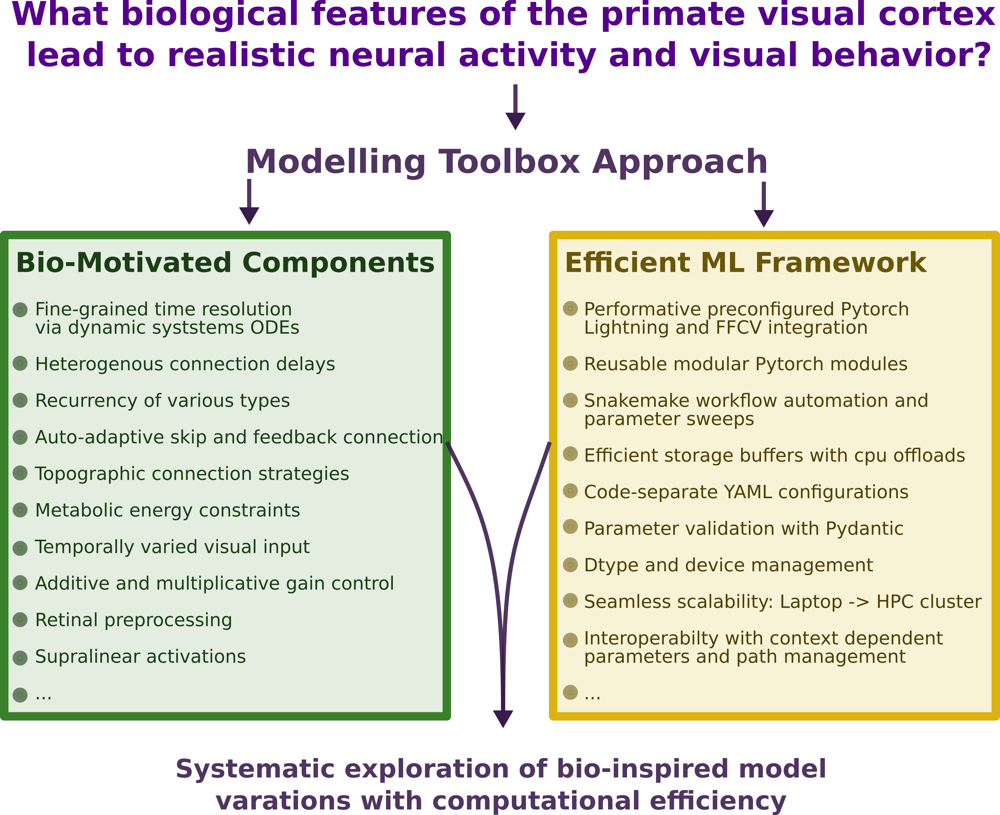
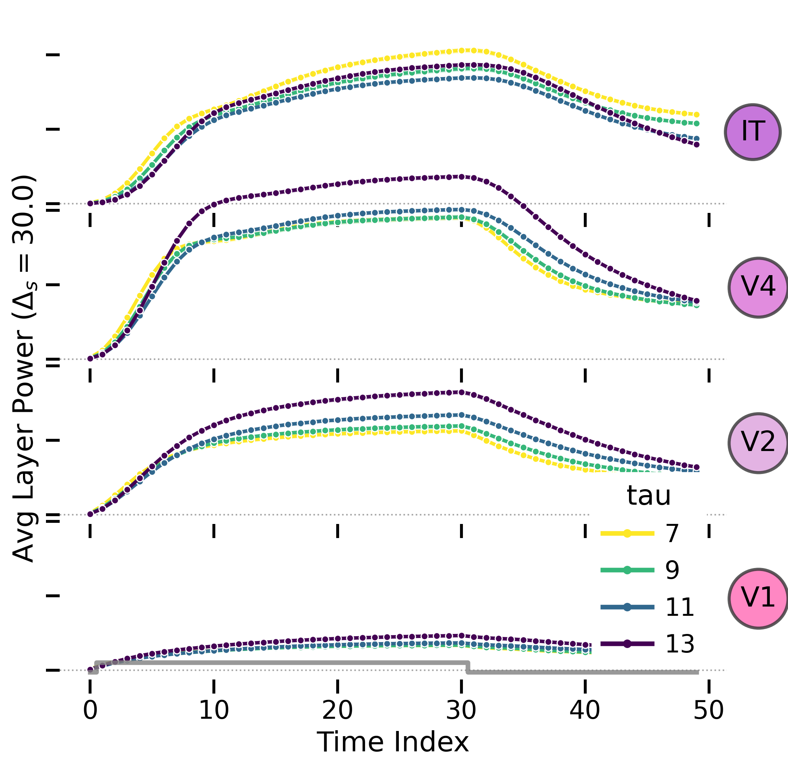

# DynVision: A Modeling Toolbox for Biologically Plausible Recurrent Visual Networks

[](https://www.python.org/downloads/)
[](https://pytorch.org/)
[](https://opensource.org/licenses/MIT)

DynVision is a modular toolbox for constructing and evaluating recurrent convolutional neural networks (RCNNs) with biologically inspired dynamics. It provides a flexible framework for exploring how recurrent connections and temporal dynamics shape visual processing in artificial neural networks and how these networks can be aligned with properties of biological visual systems.

<p align="center">
  
</p>

## Key Features

- **Biologically Plausible Dynamics**: Implement neural dynamics governed by continuous differential equations with realistic time constants and delays
- **Diverse Recurrent Architectures**: Explore various recurrent connection types (self, full, depthwise, pointwise, local topographic)
- **Minimal Coding Requirements**: Customization of models, training hyperparameters, testing scenarios, data selection, parameter sweeps, visualizations can be achieved by editing by human-readable config files. For more elaborate extensions there are template files and guides.
- **Modular Components**: Easily combine and reconfigure biologically-inspired features:
  - Recurrent processing within and across areas
  - Skip and feedback connections
  - Retinal preprocessing
  - Supralinear activation
  - Adaptive input gain
- **Modular Operation Order**: Easily rearrange the execution order of layer operations like convolution, adding recurrence, applying delays, nonlinearity, pooling, recording activity, etc.
- **Efficient Workflow Management**: Leverages Snakemake for reproducible experiments and parameter sweeps
- **PyTorch Lightning Integration**: Standardized training with minimal boilerplate
- **Optimized Performance**: Fast data loading with FFCV, GPU acceleration, mixed precision
- **Comprehensive Model Zoo**: Access pre-implemented architectures like AlexNet, CorNetRT, ResNet, CordsNet, and DyRCNNx4

## Installation

```bash
# Clone repository
git clone https://github.com/Lindsay-Lab/dynvision.git
cd dynvision

# Create conda environment
conda create -n dynvision python=3.11
conda activate dynvision

# Install dependencies
pip install -e .
```

For more detailed installation instructions, see the [Installation Guide](docs/user-guide/installation.md).

## Quick Start

```python
import torch
from dynvision.models import DyRCNNx4

# Create a 4-layer RCNN with recurrent connections
model = DyRCNNx4(
    n_classes=10,
    input_dims=(20, 3, 224, 224),  # (timesteps, channels, height, width)
    recurrence_type="full",        # Full recurrent connectivity
    dt=2,                          # Integration time step (ms)
    tau=5,                         # Neural time constant (ms)
    tff=8,                         # feedforward delay (ms)
    trc=4,                         # recurrence delay (ms)
)

# Forward pass with a batch of inputs
batch = torch.randn(1, 20, 3, 224, 224)  # (batch, timesteps, channels, height, width)
outputs = model(batch)
```

For a step-by-step tutorial, see the [Getting Started](docs/getting-started.md) guide.

## Example Experiments

DynVision includes pre-configured experiments to explore temporal response properties of different recurrent architectures:

```bash
# Train and run contrast response experiment with on multiple models
snakemake --config experiment=contrast model_name=['AlexNet', 'ResNet18', 'CorNetRT'] data_name=cifar100

# Evaluate stimulus duration effects with different recurrence types
snakemake -j4 --config experiment=duration model_name=DyRCNNx4 model_args="{rctype: [full, self, pointdepthwise]}"
```

<p align="center">
  
</p>

## Documentation

- [Getting Started](docs/getting-started.md): Beginner's tutorial
- [User Guide](docs/user-guide/index.md): How-to guides for common tasks
- [API Reference](docs/reference/index.md): Technical documentation
- [Concepts](docs/explanation/concepts.md): Explanation of core concepts
- [Contributing](docs/contributing.md): How to contribute to the project

<!-- ## Citation

If you use DynVision in your research, please cite our paper:

```bibtex
@article{dynvision2023,
  title={DynVision: A Modeling Toolbox for Biologically Plausible Recurrent Visual Networks},
  author={Anonymous},
  journal={ArXiv},
  year={2023}
}
``` 

TODO: add rrid, zenodo

-->

## License

This project is licensed under the MIT License - see the [LICENSE](LICENSE) file for details.
