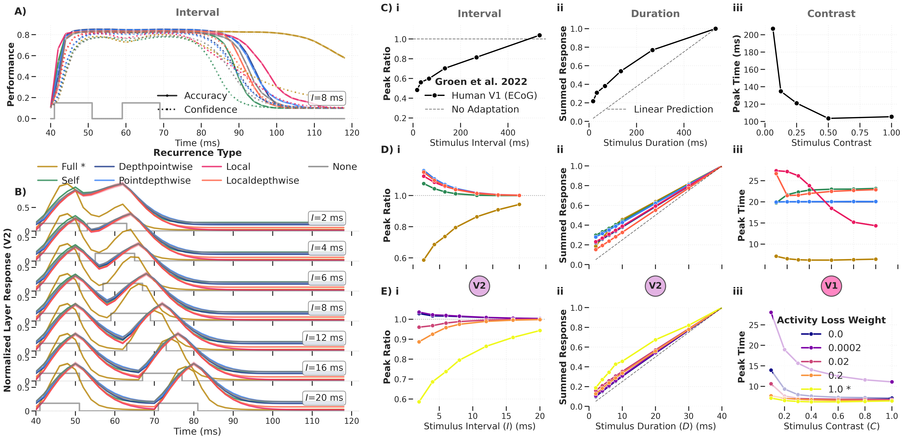
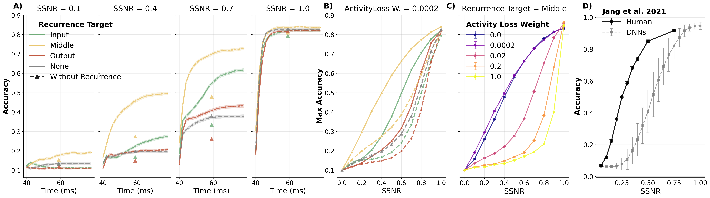
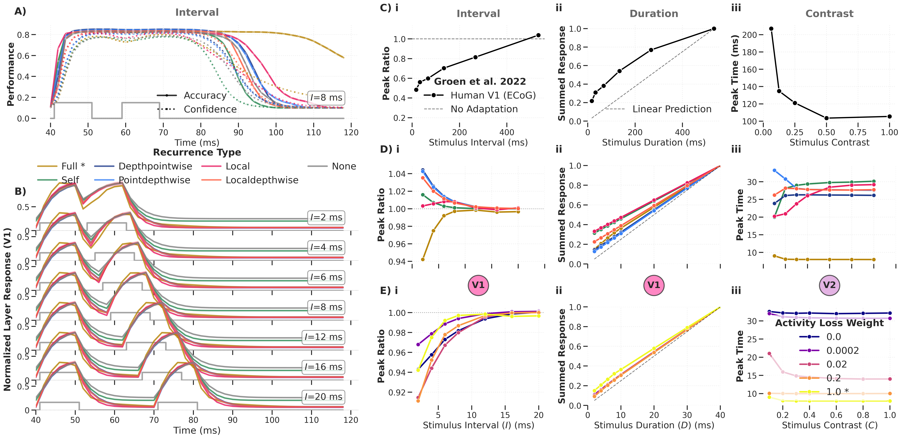

# Comparison to Neural Data

This explanation summarises how DynVision model responses compare to
electrophysiological recordings and human behavioural data.

## Approach

We compare model dynamics to real neural data using methods inspired by neural
data analysis. Following Groen et al. (2022), we test whether models exhibit
temporally delayed normalisation: adaptation to repeated stimuli, sublinear
summation to stimuli of increasing duration, and contrast‑dependent reaction
time.

As an analogue of ECoG broadband power, we average model activations per layer
and timestep. The temporal presentation pattern `1011` (shuffled) is used during
training to improve null‑response behaviour.

## Temporal Normalisation Without Explicit Normalisation

  

*Figure: Temporal dynamics of the DyRCNNx8 model for different recurrence types,
tested on varied inter‑stimulus interval (i), stimulus duration (ii), and
contrast (iii). Panel C shows experimental ECoG data from Groen et al. (2022);
panels D and E show the corresponding characteristics in model variants.*

Key findings:

- **Adaptation** (reduced response to repeated stimuli, peak ratio < 1) emerges
  **only** for *full* recurrence with *large* activity‑loss weights. Other
  recurrence types show the opposite: the second peak is *larger* than the first.
- **Sublinear summation** is also most pronounced for full recurrence with
  strong activity loss.
- **Contrast‑dependent reaction time** appears for *local* recurrence or for
  full recurrence with *minimal* activity loss — the opposite condition to
  adaptation and summation.

The model architecture contains **no explicit normalisation operation**. Any
normalisation effect relies entirely on recurrent connections — demonstrating
that continuous‑time recurrent dynamics can naturally produce cortical temporal
phenomena.

## Two Functionally Distinct Regimes

These results reveal a **dissociation** between two dynamic regimes:

| Regime | Configuration | Phenomena |
|--------|---------------|-----------|
| Temporal normalisation | Full recurrence, output target, strong activity loss | Adaptation, sublinear summation |
| Noise robustness | Full recurrence, middle target, minimal activity loss | Human‑level noise robustness, contrast‑dependent RT |

## Noise Robustness vs. Humans

  

*Figure: Noise robustness depends on where the recurrent signal is integrated
(input, middle, or output). The middle‑target variant best captures human
performance trends (panel D, Jang et al. 2021). Disabling recurrence at test
time (△ markers) confirms that robustness comes from active temporal
integration, not static architecture.*

Higher activity‑loss weights **reduce** noise robustness, creating an unexpected
trade‑off: the same constraint that promotes biologically realistic
normalisation also degrades robustness.

## Supplementary Results

Additional comparisons are available for:

- **V1 vs V2 layer responses** across recurrence types and targets (triggering
  complementary results where V1 responses to contrast experiments better match
  the data).
- **Feedback connections** — no systematic noise‑robustness benefit across seeds.
- **Different recurrence types** at matched noise‑robustness conditions.

  

*Figure: Same analysis with V1 and V2 layer summaries swapped, showing that V1
responses to contrast experiments better match the Groen et al. reference data.*

## References

- Groen, I. I. A., et al. (2022). Temporal Dynamics of Neural Responses in
  Human Visual Cortex.
- Jang, H., et al. (2021). Noise‑trained deep neural networks effectively
  predict human vision in a crowded task.
- Heeger, D. J., & Mackey, W. E. (2019). ORGaNICs.
- Rubin, D. B., et al. (2015). The stabilized supralinear network.

## See Also

- [Temporal Dynamics](temporal_dynamics.md) — dynamical systems formulation
- [Role of Recurrence](role-of-recurrence.md)
- [Biological Plausibility](biological-plausibility.md)
