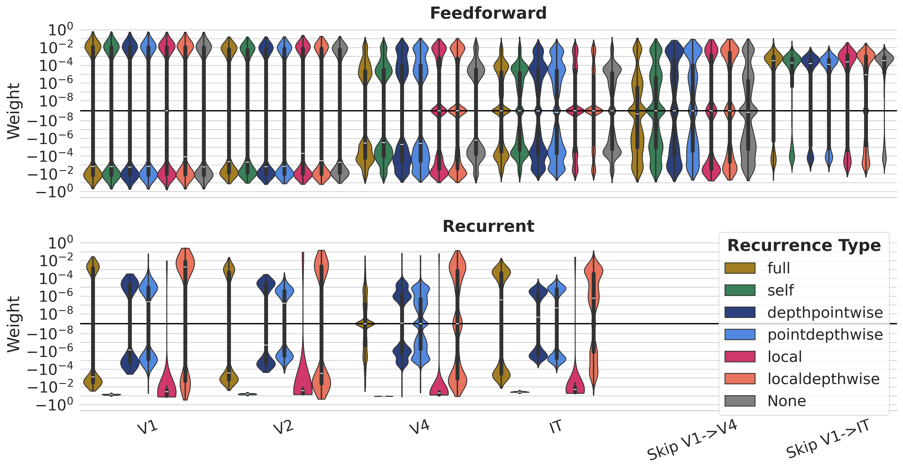
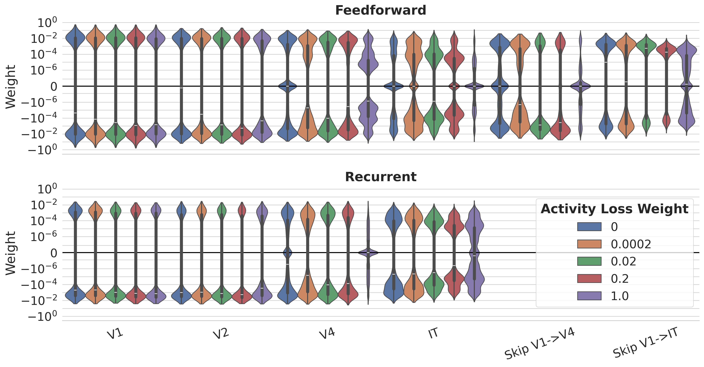

# The Role of Recurrence in Visual Processing

!!! note "Understanding-oriented"
    This page discusses *why* recurrent connections matter for modeling the
    ventral visual stream. For the concrete connection types DynVision
    implements, see the
    [Recurrence Types reference](../reference/recurrence-types.md).

## Feedforward models are not enough

Standard convolutional networks are purely feedforward, yet the primate visual
system is densely recurrent. Lateral and feedback connections are thought to
support contextual modulation, figure–ground segregation, predictive
processing, and robust recognition under challenging conditions (occlusion,
noise, low contrast).

Empirically, recurrence has been shown to be necessary to capture the
representational *dynamics* of the human visual system (Kietzmann et al., 2019)
and to explain behavior on harder recognition tasks where feedforward models
fall short (Kar et al., 2019).

## What recurrence buys a model

DynVision lets researchers study several distinct functional contributions of
recurrence:

- **Temporal normalization** — recurrent inhibition can reproduce adaptation,
  sublinear temporal summation, and contrast-dependent response timing without
  explicit divisive-normalization operators.
- **Noise robustness** — recurrent dynamics can stabilize representations under
  input perturbations, approaching human-level robustness in some regimes.
- **Iterative inference** — recurrence allows the network to refine its estimate
  over biological time, rather than committing to a single feedforward pass.

A key empirical finding from DynVision is that these roles can *dissociate*:
different architectural placements of recurrence and different metabolic-cost
weightings push the network into qualitatively different dynamic regimes.

## Connections in DynVision

| Connection type | Biological analogue |
|-----------------|---------------------|
| Self / full lateral recurrence | Horizontal connections within a cortical area |
| Feedback | Top-down projections from higher to lower areas |
| Skip | Long-range projections between non-adjacent areas |

## Weight Distribution Insights

Analysis of learned weights reveals systematic patterns across recurrence types
that explain the two functional regimes:

  

*Figure: Recurrent weight distributions for models trained with different
connection types. Self‑recurrence produces strongly negative (inhibitory) weights;
local recurrence produces a mix of negative values; full and sparser types remain
near zero. Feedforward weight distributions (not shown) are consistent across all
variants.*

  

*Figure: Feedforward and recurrent weight distributions across activity‑loss
weighting. Recurrent weights remain consistently small and negative across all
regularisation strengths, while feedforward weights are unaffected.*

## See also

- Reference: [Recurrence Types](../reference/recurrence-types.md)
- Explanation: [Temporal Dynamics](temporal_dynamics.md)
- Explanation: [Biological Plausibility](biological-plausibility.md)
