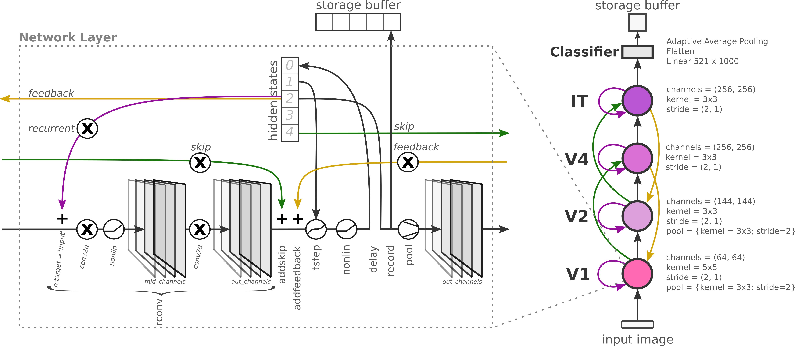

# Integration Strategies

How recurrent, skip, and feedback signals are combined with the feedforward
signal.

## Available Strategies

Set via `integration_strategy`:

| Strategy | Formula | Description |
|----------|---------|-------------|
| `additive` | $x' = x + h$ | Default. Simple addition. |
| `multiplicative` | $x' = x \cdot (1 + \tanh(h))$ | Gain‑modulation via tanh‑squashed signal. |
| *callable* | $x' = f(x, h)$ | Any user‑supplied callable. |

  

## Recurrence Target

The integration **location** is controlled by `recurrence_target` (also applies
to skip/feedback positions in the `layer_operations` list):

| Target   | Description |
|----------|-------------|
| `input`  | Integrated with the input tensor to the layer *before* convolutions. |
| `middle` | Integrated with intermediate activations *between* two convolutions (only applicable for layers with `mid_channels`). |
| `output` | Integrated with the output tensor *after* all convolutions. |

## Feedforward‑Only Mode

Setting `feedforward_only = True` disables all recurrent/skip/feedback
integration at inference time — useful for measuring the contribution of
recurrence to performance.

## See Also

- [Recurrence Types](recurrence-types.md)
- [Skip & Feedback Connections](skip-feedback-connections.md)
- [Layer Operations](layer-operations.md)
